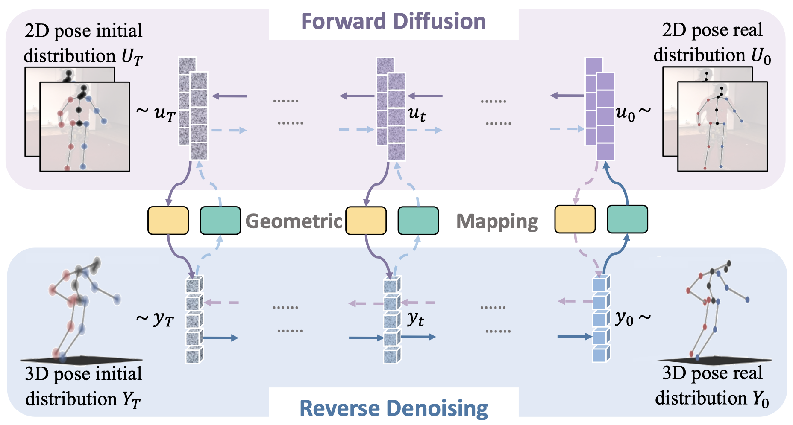
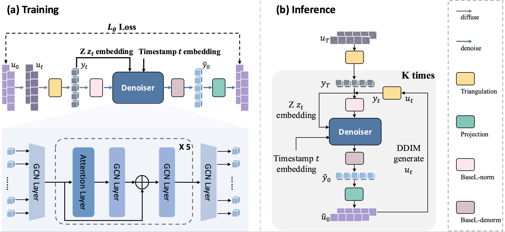

# [Dual-Diffusion for Binocular 3D Human Pose Estimation, NeurIPS2024]


## Dual-Diffusion Model Architecture

<p align="center">  </p>

## Dual-Diffusion Process

<p align="center">  </p>

Our code is built on top of [DDIM](https://github.com/ermongroup/ddim) and [DiffPose](https://GONGJIA0208.github.io/Diffpose/).

### Environment

You can create the environment via:

```bash
pip install -r requirement.txt
```

### Dataset

The data includes:
1. labels (update the labels_path in the config.)
2. 2D poses estimated from 2D pose estimator (put into the `./data` directory)
3. statistical or fixed mean and standard deviation of the estimated 2D poses (put into the `./data` directory)

#### human3.6
The H36M dataset is preprocessed according to steps 1-5 in [learnabel_triangulation](https://github.com/karfly/learnable-triangulation-pytorch/blob/master/mvn/datasets/human36m_preprocessing/README.md). Then the binocular labels are generated according to [stereo_estimation](https://github.com/sherrywan/stereo-estimation).

#### MHAD
The MHAD dataset is preprocessed by [MHAD_Berkeley_preprocess](https://github.com/sherrywan/MHAD_Berkeley_preprocess). Then the binocular labels are generated according to [MHAD_Berkeley_stereo](https://github.com/sherrywan/stereo-estimation/blob/main/lib/datasets/mhad_preprocess/readme.md).

Note that we only provide the 2D poses estimated from RSB-Pose.

### Training

-   To train a model, run:

```bash
CUDA_VISIBLE_DEVICES=0 python main_diffpose_2view_frame.py --train \
--config mhad_2view_diffpose_uvxyz_rsb152.yml --batch_size 1024 \
--model_diff_path checkpoints/ckpt_mhad_rsb152.pth \
--doc mhad_2view_diffpose_uvxyz_rsb152 --exp exp --ni
```

### Testing
We provide the pre-trained model (with RSB-Pose 2D Pose as input) [here](通过网盘分享的文件：checkpoints
链接: https://pan.baidu.com/s/1cP10IVxcOQGHEfYoxdvFVw?pwd=qdd3 提取码: qdd3 
--来自百度网盘超级会员v4的分享). To evaluate it, put it into the `./checkpoint` directory.

-   To evaluate, run:

```bash
CUDA_VISIBLE_DEVICES=0 python main_diffpose_2view_frame.py \
--config mhad_2view_diffpose_uvxyz_rsb152.yml \
--test_timesteps 1 \
--model_diff_path checkpoints/ckpt_mhad_rsb152.pth \
--doc t_mhad_2view_diffpose_uvxyz_rsb152 --exp exp --ni
```


<!-- ## Bibtex

If you find our work useful in your research, please consider citing:

    @InProceedings{gong2023diffpose,
        author    = {Gong, Jia and Foo, Lin Geng and Fan, Zhipeng and Ke, Qiuhong and Rahmani, Hossein and Liu, Jun},
        title     = {DiffPose: Toward More Reliable 3D Pose Estimation},
        booktitle = {Proceedings of the IEEE/CVF Conference on Computer Vision and Pattern Recognition (CVPR)},
        month     = {June},
        year      = {2023},
    } -->

## Acknowledgement

Part of our code is borrowed from [DDIM](https://github.com/ermongroup/ddim), [DiffPose](https://GONGJIA0208.github.io/Diffpose/), [learnabel_triangulation](https://github.com/karfly/learnable-triangulation-pytorch/), and [stereo_estimation](https://github.com/sherrywan/stereo-estimation). We thank the authors for releasing the codes.
